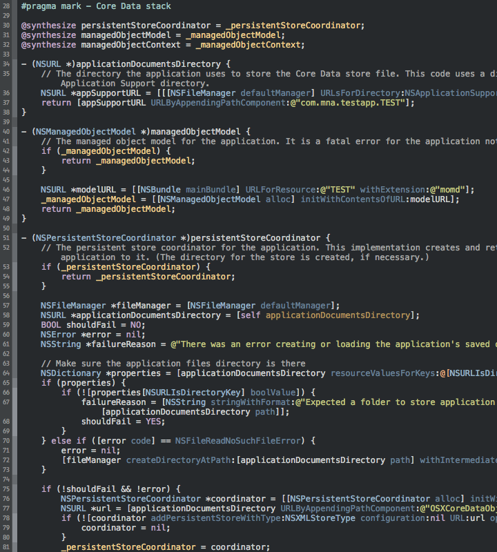

# xcode-themes
Xcode themes

# Themes
## Tomorrow Night - mna
Base: [Tomorrow Night](https://github.com/chriskempson/tomorrow-theme/blob/master/Xcode%204/Tomorrow%20Night.dvtcolortheme)

# Installation

1. Get theme file(s) and place it in `~/Library/Developer/Xcode/UserData/FontAndColorThemes`
2. Restart Xcode
3. Xcode > Preferences > Fonts & Colors
4. Select a theme